# data-lake-pipeline

Build a simple Data Lake for non-tech guys 

1. What is data centralization ?
- Definition 

    Data centralization brings together all data into one place so it can be more effectively managed and accessed
- Benefits of data centralization

    - Eliminates data silos

        Centralizing data increases collaboration among teams and ensures that everyone has access to validated, complete data sets.
    - Improved data governance

        Centralizing data access creates a less complex environment for data, making it easier to monitor and control the use and protection of data.
    - Better data analytics

        Data centralization ensures that analytics efforts produce accurate, actionable insights by ensuring that all current, relevant data is immediately accessible for queries. 
    - Cost-effective, scalable data storage
- Data Warehouse or Data Lake for data centralization ?


    | Aspect | Data Warehouse | Data Lake    |
    | ------ | ------ | --- |
    | Data Type  | Structured data       | Unstructured, semi-structured, structured data|
    | Schema     |  Schema-on-write (predefined schema)      | Schema-on-read (schema flexibility)|
    |Processing Paradigm | Batch processing| Supports batch and real-time processing|
    |Query Performance | High performance for structured data queries| Varied performance; may require optimization for queries|
    | Scalability| May have limitations in handling massive data volumes| Highly scalable, can handle vast amounts of data|
    | Use Cases| Business intelligence, reporting, structured analytics| Advanced analytics, machine learning, data exploration|
    | Flexibility| Limited flexibility due to predefined schema| Flexible schema, supports diverse data types|
    | Data Quality| High data quality with enforced schemas| Requires careful data governance for quality control|
    | Costs|Generally higher costs for storage and processing | Lower storage costs; processing costs can vary|
    |Implementation Time | Typically shorter implementation time| Longer implementation time due to schema flexibility|
    | Maturity| Mature technology with established best practices| Evolving technology with ongoing advancements|


    
    Factors to consider

    - Data Structure: 

        - Data Warehouse: data is highly structured and the use case is reporting or analytics
        - Data Lake: data is diverse and raw
    - Query performance:
        - Data Warehouse: fast query performance is critical
        - Data Lake: may require additional processing steps for optimal query performance
    - Flexibility: 
        - Data Lake: offer more flexibility in terms of data types and schema evolution

    Based on my personal experience, I have a preference for utilizing a Data Lake for centralizing data

2. What is Data Lake ?
- Definition 

    A Data Lake is a centralized repository that allows you to store all your structured and unstructured data at any scale. You can store your data as-is, without having to first structure the data, and run different types of analytics—from dashboards and visualizations to big data processing, real-time analytics, and machine learning to guide better decisions.
- Benefits 

    - The main advantage of Data Lake is the centralization of different content sources
    - Offers cost-effective scalability and flexibility
    - Reduces long-term cost of ownership
    - Quickly adaptable to changes
    - Flexible access to the data

- Risk of using Data Lake 

    - The biggest risk of data lakes is security and access control. Sometimes data can be placed into a lake without any oversight, as some of the data may have privacy and regulatory need
    - It also increases storage & computes costs
    - Unstructured Data may lead to Ungoverned Chao, Unusable Data, Disparate & Complex Tools, Enterprise-Wide Collaboration, Unified, Consistent, and Common
    - After some time, Data Lake may lose relevance and momentum

3. Data Lake Architecture 
- Logical Architecture 

    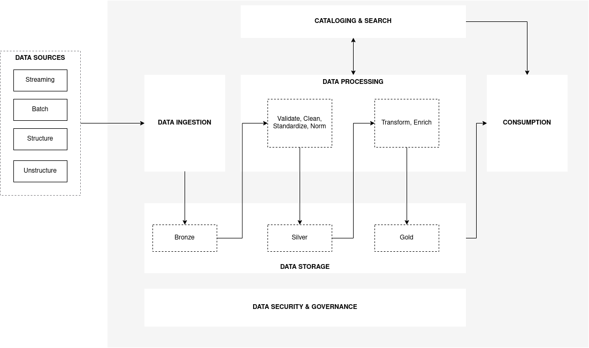
- Components 


    | Modules | Description |
    | ------ | ------ |
    |     Data Ingestion   |   The ingestion layer is responsible for bringing data into the Data Lake: <br> &emsp; - It provides the ability to connect to internal and external data sources over a variety of protocols. <br> &emsp; - It can ingest batch and streaming data into the storage layer. <br> <br> The ingestion layer is also responsible for delivering ingested data to a diverse set of targets in the data storage layer (including the object store, databases, and warehouses).     |
    |Data Storage|The storage layer is responsible for providing durable, scalable, secure, and cost-effective components to store vast quantities of data. <br> &emsp; - It supports storing unstructured data and datasets of a variety of structures and formats. <br> &emsp; - It supports storing source data as-is without first needing to structure it to conform to a target schema or format.  <br> <br> The storage layer is organized into the following zones: <br> &emsp; - **Bronze zone** – The storage area where components from the ingestion layer land data. This is a transient area where data is ingested from sources as-is. Typically, data engineering personas interact with the data stored in this zone. <br> &emsp; - **Silver zone** – After the preliminary quality checks, the data from the raw zone is moved to the silver zone for permanent storage. Here, data is stored in its original format. Having all data from all sources permanently stored in the silver zone provides the ability to “replay” downstream data processing in case of errors or data loss in downstream storage zones. Typically, data engineering and data science personas interact with the data stored in this zone.<br> &emsp; - **Gold zone** – This zone hosts data that is in the most consumption-ready state and conforms to organizational standards and data models. Datasets in the gold zone are typically partitioned, cataloged, and stored in formats that support performant and cost-effective access by the consumption layer. The processing layer creates datasets in the gold zone after cleaning, normalizing, standardizing, and enriching data from the raw zone. All personas across organizations use the data stored in this zone to drive business decisions.|
    |      Data Catalog & Search | The cataloging and search layer is responsible for storing business and technical metadata about datasets hosted in the storage layer. <br> &emsp; - It provides the ability to track schema and the granular partitioning of dataset information in the lake. <br> &emsp; - It also supports mechanisms to track versions to keep track of changes to the metadata.
    |Data Processing|The processing layer is responsible for transforming data into a consumable state through data validation, cleanup, normalization, transformation, and enrichment. <br> <br>  The processing layer also provides the ability to build and orchestrate multi-step data processing pipelines that use purpose-built components for each step.|  
    Data Consumption​ | The consumption layer is responsible for providing scalable and performant tools to gain insights from the vast amount of data in the Data Lake. <br> &emsp; - support analysis methods, including SQL, batch analytics, BI dashboards, reporting, and ML. 
    Data Governance & Security | The security and governance layer is responsible for protecting the data in the storage layer and processing resources in all other layers. <br> &emsp; - It provides mechanisms for access control, encryption, network protection, usage monitoring, and auditing. <br> &emsp; - The security layer also monitors activities of all components in other layers and generates a detailed audit trail. 
    
    To simplify the Data Lake, I have omitted the components of data governance and security, as well as data catalog and search

- Simplified Deployment Architecture 

    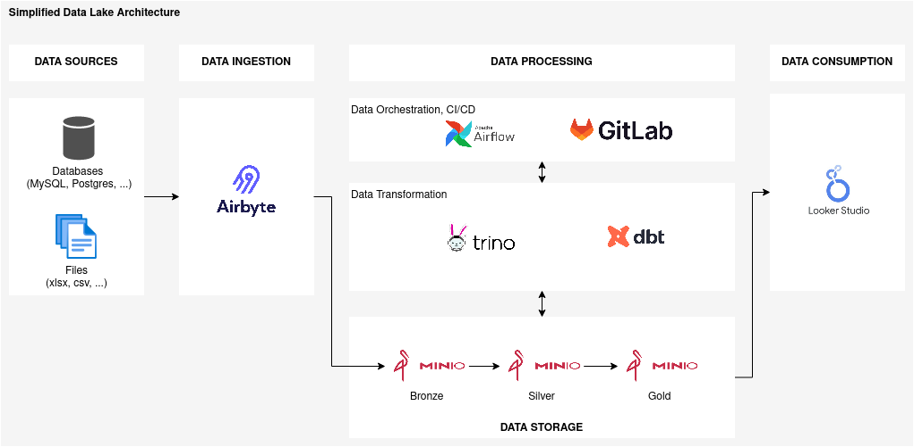

    | Modules | Tools | Why this tools | Alternative tools|
    | ------ | ------ |--|--|
    |   Data Ingestion     |   Airbyte     | Free, Open-source, Easy to use  | Apache NiFi, Talend, Stitch, Matillion   |
    |     Data Storage   |   Minio     | Free, Similar to AWS S3| AWS S3 |
    | Data Processing (Transformation) | Trino| Free, Similar to AWS Athena| AWS Athena, Apache Hive | 
    | Data Processing (Transformation)| dbt|Free, Familiar with the data stack  | Dataform|
    | Data Processing (Orchestrator)| Airflow| Free, Familiar with the data stack| Apache NiFi, AWS Step Functions, Google Cloud Composer|
    | Data Processing (CI/CD)| GitLab| Free, Familiar with the data stack| Jenkins, GitHub Actions, AWS CodePipeline|
    |Data Consumption​ (Visualization)|LookerStudio| Free| PowerBI, Tableau| 

    Factor to consider tools in this lab:
    
    - Cost must be free to ensure that everyone can access it
    - Similar to AWS Data Service, it is widely utilized by many large companies and enterprises, making it a commonplace choice 
- Setup tools 

    _All tool are installed on Ubuntu 22.04.3 LTS_
   
    _Assuming a non-technical audience, I'll provide a detailed explanation of the setup process to ensure clarity. Please don't feel embarrassed._
    
    To efficiently organize files and tools, I recommend creating a dedicated folder to contain them all. Open the terminal and type this command 
    ```yaml
    # create a folder datalake 
    mkdir datalake
     ```
    - Docker 

        While Docker may not be listed as a data lake component, installing it is necessary for the installation of other tools (I will provide further explanation once I have a clearer understanding ^-^)

        ```yaml 
        # Update the apt package index
        sudo apt-get update
        # Install packages to allow apt to use a repository over HTTPS
        sudo apt-get install apt-transport-https ca-certificates curl software-properties-common
        # Add Docker's official GPG key
        curl -fsSL https://download.docker.com/linux/ubuntu/gpg | sudo gpg --dearmor -o /usr/share/keyrings/docker-archive-keyring.gpg
        # Set up the stable Docker repository
        echo "deb [arch=amd64 signed-by=/usr/share/keyrings/docker-archive-keyring.gpg] https://download.docker.com/linux/ubuntu $(lsb_release -cs) stable" | sudo tee /etc/apt/sources.list.d/docker.list > /dev/null
        # Update the apt package index again
        sudo apt-get update
        # Install the latest version of Docker Engine and containerd
        sudo apt-get install docker-ce docker-ce-cli containerd.io
        # Start the Docker service
        sudo systemctl start docker
        # Enable Docker to start on boot
        sudo systemctl enable docker
        # Verify that Docker is installed correctly by running a simple test
        sudo docker run hello-world
        # Check docker version 
        docker --version
        ``` 
        After installing Docker, proceed to install Docker Compose
        ```yml 
        # Download the Docker Compose binary
        sudo curl -L "https://github.com/docker/compose/releases/latest/download/docker-compose-$(uname -s)-$(uname -m)" -o /usr/local/bin/docker-compose
        # Ensure that the binary is executable
        sudo chmod +x /usr/local/bin/docker-compose
        # Verify the installation
        docker-compose --version
        ```
    - Postgres 

        Although Postgres is not listed as a data lake component, I plan to use it as a data source to demonstrate the ingestion process. While other databases can be used for this purpose, I recommend Postgres because it's free, which is a crucial factor to consider.
        ```yml 
        # Navigate into the 'datalake' folder created earlier 
        cd datalake
        # Create the 'postgres' folder
        mkdir postgres
        # Navigate into the 'postgres' folder
        cd postgres

        # Create the 'init-scripts' folder to manage scripts 
        mkdir init-scripts
        # Navigate into the 'init-scripts' folder
        cd init-scripts
        # Create a new file named 'init.sql' using a text editor to create multiple databases 
        touch init.sql        
        # Open init.sql with a text editor
        nano init.sql
        # In this file, we define databases with these value. You can replace src_postgres_demo, scr_datalake_demo with your own values  
        CREATE DATABASE src_postgres_demo;
        CREATE DATABASE scr_datalake_demo; 
        # After defining the init.sql file, save it by pressing 'Ctrl + O', then press 'Enter', and exit the file by pressing 'Ctrl + X

        # Create a new file named 'docker-compose.yml' using a text editor
        touch docker-compose.yml
        # Open docker-compose.yml with a text editor and define the PostgreSQL service 
        nano docker-compose.yml

        # Replace 'your_username', 'your_password', 'your_custom_postgres_container_name' with your own value
        version: '3'
        services:
          postgres:
            container_name: your_custom_postgres_container_name
            image: postgres:latest
            environment:
              POSTGRES_USER: your_username
              POSTGRES_PASSWORD: your_password
            ports:
              - "5432:5432"
            volumes:
              - ./init-scripts:/docker-entrypoint-initdb.d
              - ./volumes/postgres-data:/var/lib/postgresql/data            

        # Run this command
        docker-compose up -d 
        # Run this command to create database in file init.sql 
        docker-compose exec postgres psql -U your_username -d postgres -a -f /docker-entrypoint-initdb.d/init.sql 

        ``` 
        Check if the database is created 
        ```yml
        # Access the PostgreSQL container (replace 'your_postgres_container_name' with 'container_name' in docker-compose.yml)
        docker exec -it your_postgres_container_name bash
        # Connect to PostgreSQL (replace 'your_username' and 'your_database_name' with values in docker-compose.yml)
        psql -U your_username -d your_database_name
        # Check if the database exists: Within the psql shell, you can list the databases
        \l 
        # Exit the psql shell
        \q
        # Exit the container 
        exit 
        ``` 
    - Airbyte 

        Docker needs to be installed before installing Airbyte
        ```yml 
        # Navigate to the folder datalake 
        cd datalake 
        # clone Airbyte from GitHub
        git clone --depth=1 https://github.com/airbytehq/airbyte.git
        # switch into Airbyte directory
        cd airbyte
        # start Airbyte
        ./run-ab-platform.sh
        ``` 
        In your browser, visit http://localhost:8000
        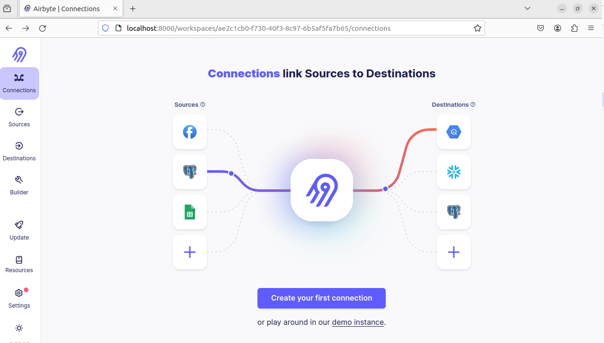

    - Airflow 

        Docker needs to be installed before installing Airflow 
        ```yml 
        # Navigate to the folder datalake 
        cd datalake 
        # Create the 'airflow' folder
        mkdir airflow
        # Navigate into the 'airflow' folder
        cd airflow
        # Fetching docker-compose.yaml
        curl -LfO 'https://airflow.apache.org/docs/apache-airflow/2.8.0/docker-compose.yaml'
        # Setting the right Airflow user
        mkdir -p ./dags ./logs ./plugins ./config
        echo -e "AIRFLOW_UID=$(id -u)" > .env
        # Initialize the database
        docker-compose up airflow-init
        # Cleaning-up the environment
        docker-compose down --volumes --remove-orphans
        # Running Airflow
        docker-compose up -d 
        ```
        In your browser, visit  http://localhost:8080.
        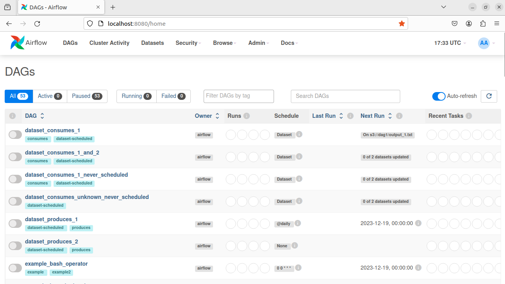

        We observe numerous example DAGs here. To eliminate them, set the value of AIRFLOW__CORE__LOAD_EXAMPLES from 'true' to 'false'.

        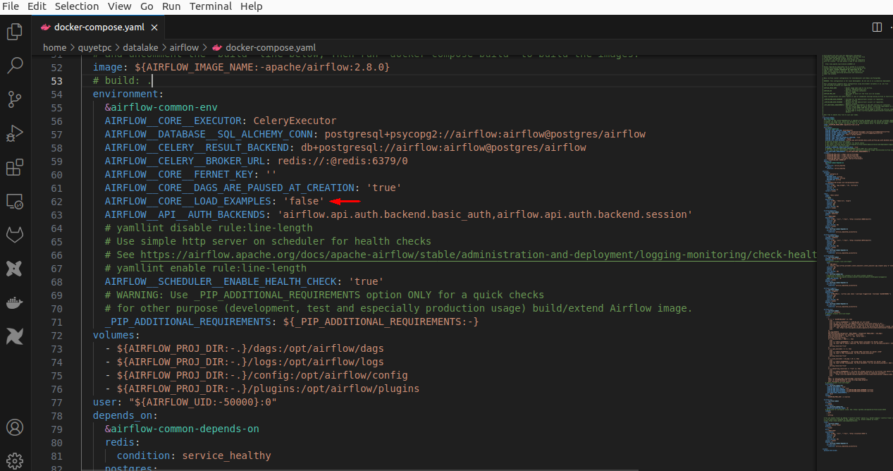

        All example DAGs are disabled.

        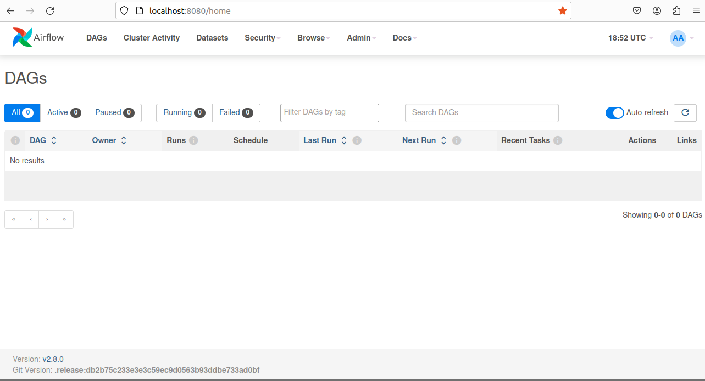

    - dbtCore 
        ```yml 
        # Navigate to the folder datalake 
        cd datalake 
        # Create the 'dbt' folder
        mkdir dbt
        # Navigate into the 'dbt' folder
        cd dbt
        # Create a new venv
        python3 -m venv dbt-env
        # Activate that same virtual environment each time you create a session
        source dbt-env/bin/activate
        # Installing the adapter
        python -m pip install dbt-trino
        # Verify the installation
        dbt --version 
        ```
    - MinIO 
        ```yml
        # Navigate to the folder datalake 
        cd datalake 
        # Create the 'MinIO' folder
        mkdir MinIO
        # Navigate into the 'MinIO' folder
        cd MinIO
        # Create a new directory for Minio data
        mkdir data 

        # In folder MinIO Create a new file named 'docker-compose.yml' using a text editor
        touch docker-compose.yml
        # Open docker-compose.yml with a text editor
        nano docker-compose.yml

        # Open the docker-compose.yml file with a text editor and define the MinIO 
        version: '3'
        services:
        minio:
            image: minio/minio
            container_name: minio
            environment:
            - MINIO_ROOT_USER=admin
            - MINIO_ROOT_PASSWORD=password
            ports:
            - "9000:9000"
            - "9001:9001"
            volumes:
            - ./MinIO/data:/data
            command: server /data --console-address ":9001"
        # After defining the Docker Compose file, save it by pressing 'Ctrl + O', then press 'Enter', and exit the file by pressing 'Ctrl + X
        # Run this command
        docker-compose up -d 
        ```
        In your browser, visit  http://localhost:9001.
        Enter user/password to access MinIO 
        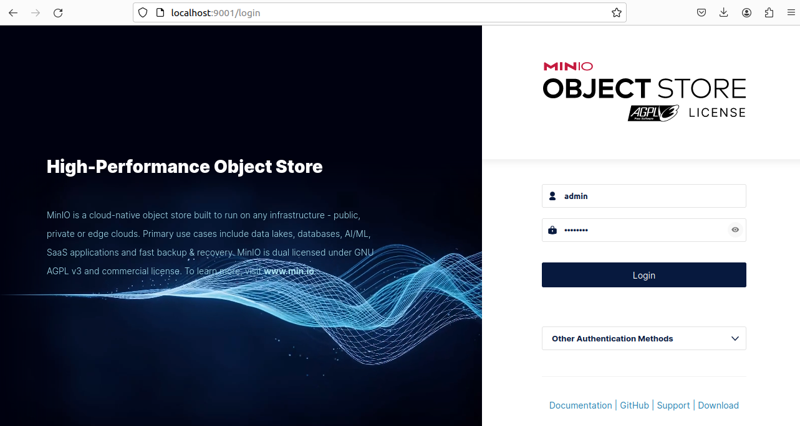
    - Trino 
        ```yml
        # Navigate to the folder datalake 
        cd datalake 
        # Create the 'trino' folder
        mkdir trino 
        # Navigate into the 'trino' folder
        cd trino       
        # Create a new file named 'docker-compose.yml' using a text editor
        touch docker-compose.yml
        # Open docker-compose.yml with a text editor
        nano docker-compose.yml

        # Open the docker-compose.yml file with a text editor and define the Trino 
        version: '3'
        services:
          trino:
            container_name: trino-container
            image: trinodb/trino
            ports:
              - "8081:8080"
            environment:
              - TRINO_CONFIG_PROPERTIES=node.environment=production
        # After defining the Docker Compose file, save it by pressing 'Ctrl + O', then press 'Enter', and exit the file by pressing 'Ctrl + X
        # Run this command
        docker-compose up -d 
        ``` 
        In your browser, visit http://localhost:8081


4. End to end project example  
    In the last part, we setup nesscessary for data lake
    In this part we will go through the data pipeline to under stand full pipeline 

    In this part:

    - Create datasource on postgres (this is not in data pipeline, but we need a data source for example)

        ```yml
        # Navigate to the folder init-scripts inside postgres  
        cd datalake/postgres/init-scripts 
        # Create a new file named 'create_table.sql' using a text editor
        touch create_table.sql 
        # Open docker-compose.yml with a text editor
        nano create_table.sql
        # Define the create table scripts 
        CREATE TABLE test_order (
        create_at date,
        order_id text, 
        user_id text,
        store_id text,
        picking_at timestamp,
        delivery_at timestamp,
        status int,
        amount float4,
        discount_amount float4, 
        tax_amount float4)
        ;

        CREATE TABLE test_status (
        status_id int,
        status text)
        ;

        CREATE TABLE test_store (
        store_id text,
        store_city text,
        store_rank text)
        ;

        CREATE TABLE test_user (
        user_id text, 
        user_name text, 
        signup_date date,
        user_type text)
        ;
        # After defining the create table scripts, save it by pressing 'Ctrl + O', then press 'Enter', and exit the file by pressing 'Ctrl + X

        #Verify our location in the /datalake/postgres/init-scripts folder; if not, navigate to it 

        # Run the following command to CREATE TABLE 
        psql -h localhost -U your_username -d your_database -a -f create_table.sql 

        # Check table created 
        psql -h localhost -U your_username -d your_database

        SELECT table_name FROM information_schema.tables WHERE table_schema = 'public';
        # To exit psql screen, using \q 
        ```

        After creating empty table with above process, we need to add data to these table 

        ```yml 
        #Verify our location in the /datalake/postgres/init-scripts folder; if not, navigate to it 
        # Create a new file named 'import_data.sql' using a text editor
        touch import_data.sh 
        # Open import_data.sql with a text editor
        nano import_data.sh
        ```

        Copy this code to import_data.sh

        ```yml 
        # Set database connection parameters (replace 'your_username' & 'your_database_name' with your own values)
        DB_HOST="localhost"
        DB_USER="your_username"
        DB_NAME="your_database_name"

        # Specify the relative folder path where CSV files are stored
        CSV_RELATIVE_FOLDER="datalake/postgres/data_demo"

        # Get the user's home directory
        USER_HOME_DIR="$HOME"

        # Construct the absolute path to the CSV folder
        CSV_FOLDER="$USER_HOME_DIR/$CSV_RELATIVE_FOLDER"

        # List of CSV files and corresponding tables
        CSV_FILES=("$CSV_FOLDER/test_order.csv" "$CSV_FOLDER/test_status.csv" "$CSV_FOLDER/test_store.csv" "$CSV_FOLDER/test_user.csv")
        TABLES=("test_order" "test_status" "test_store" "test_user")

        # Function to convert CSV file to UTF-8
        convert_to_utf8() {
            iconv -f $1 -t UTF-8 "$2" > "${2%.csv}_utf8.csv"
        }

        # Loop through the arrays, convert to UTF-8, and copy data from CSV to tables
        for ((i=0; i<${#CSV_FILES[@]}; i++)); do
            CSV_FILE="${CSV_FILES[i]}"
            TABLE="${TABLES[i]}"

            # Determine file encoding (either ISO-8859-1 or US-ASCII)
            FILE_ENCODING=$(file -bi "$CSV_FILE" | awk -F= '{print $2}')

            # Convert CSV file to UTF-8
            echo "Converting CSV file to UTF-8: $CSV_FILE"
            convert_to_utf8 "$FILE_ENCODING" "$CSV_FILE"

            # Use psql to copy data from UTF-8 CSV to table
            echo "Importing data into table: $TABLE"
            psql -h $DB_HOST -U $DB_USER -d $DB_NAME -c "\\COPY $TABLE FROM '${CSV_FILE%.csv}_utf8.csv' WITH CSV HEADER ENCODING 'UTF-8';"
            echo "Import into table $TABLE complete."
        done

        # Cleanup: Remove the _utf8.csv files
        echo "Cleaning up..."
        rm -f "$CSV_FOLDER"/*_utf8.csv

        echo "Cleanup complete."

        ``` 
        Save it by pressing 'Ctrl + O', then press 'Enter', and exit the file by pressing 'Ctrl + X' 

        ```yml 
        # Verify our location in the /datalake/postgres/init-scripts folder; if not, navigate to it 
        # Run this command to import data
        chmod +x import_data.sh 
        ./import_data.sh 
        ``` 

    - Create bucket & access key for storage in MinIO 
    
        Go to "Access Keys" on Menu, then click to "Create access key" 
        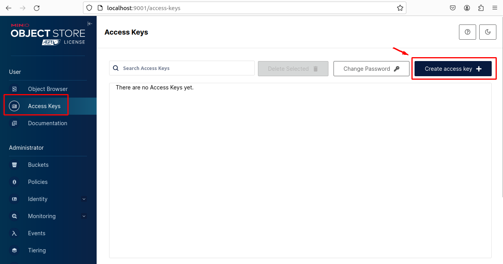

        Define the name of access key, then click "Create" 
        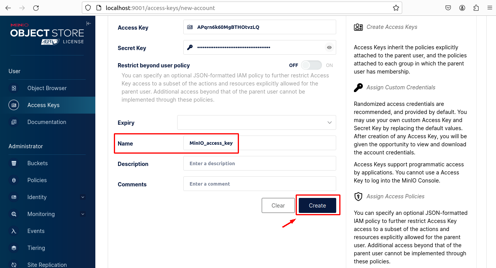

        Remember to download the file and save it in safe folder 
        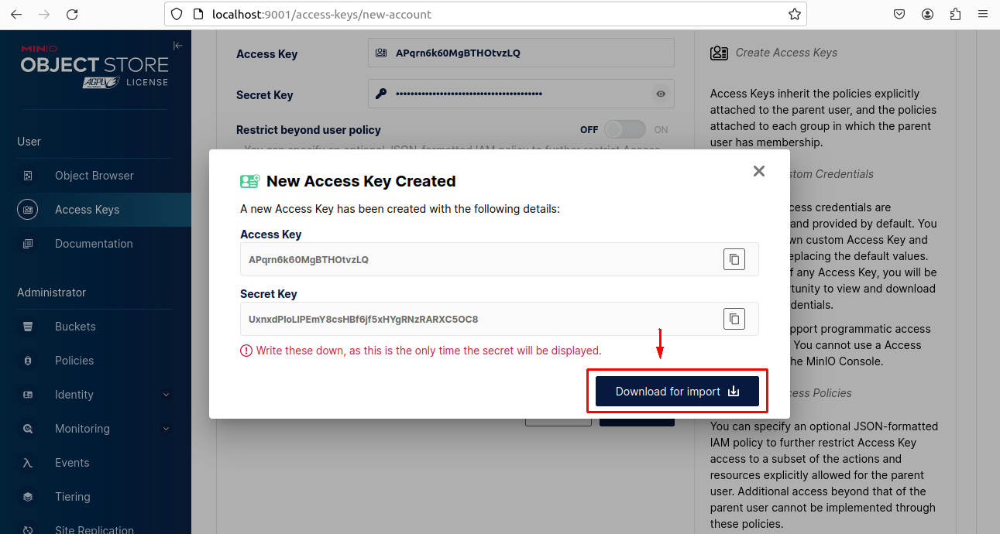

        The access key is created in lists 
        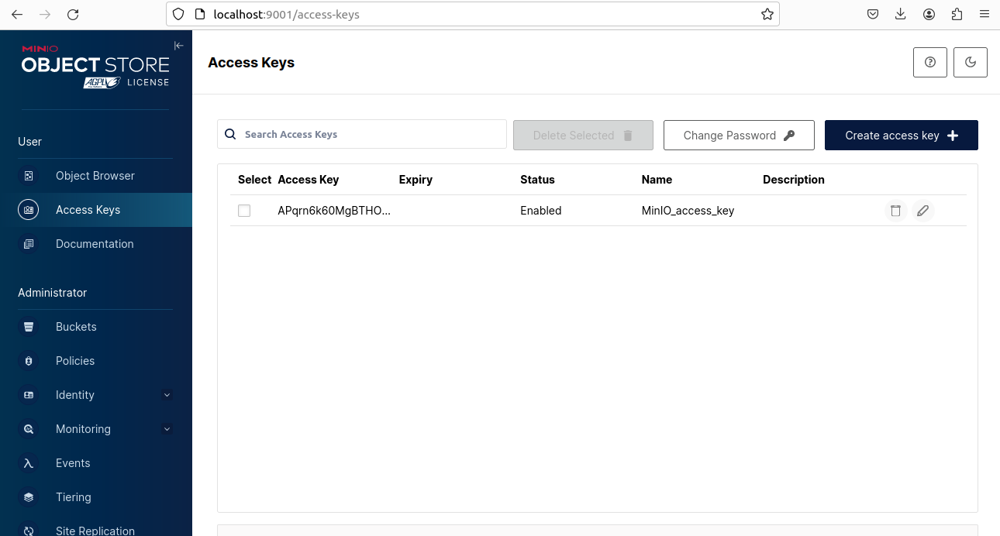

    - Ingest data from datasource to MinIO 

        - Create the connection between data source (postgres) and data destination (MinIO)

            - Go to "Connections" on Menu, then click "Create your first connection" 
            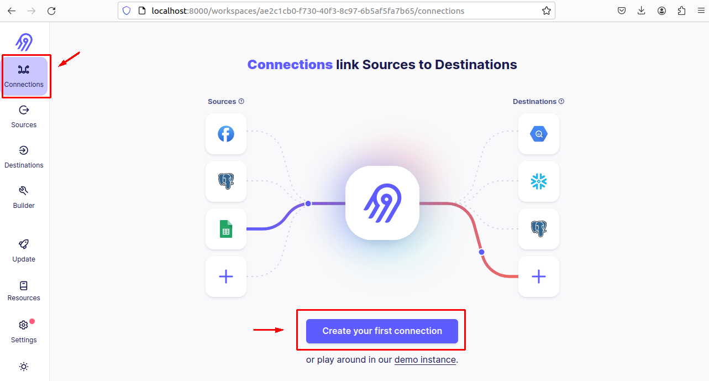

            - Set up new source 
            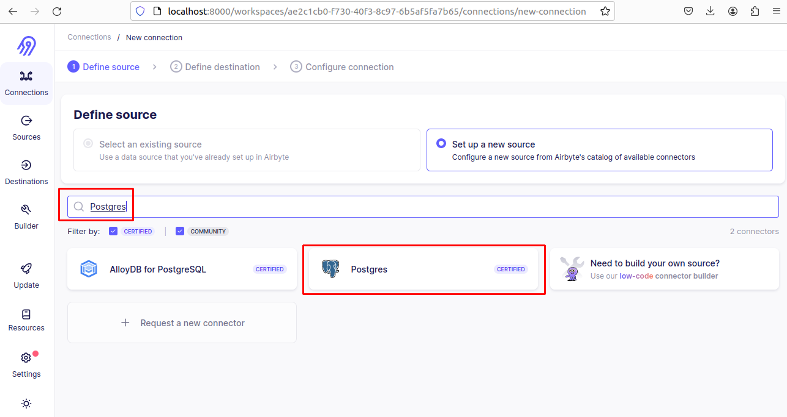

            - Configure source value, then click "Set up source" 
            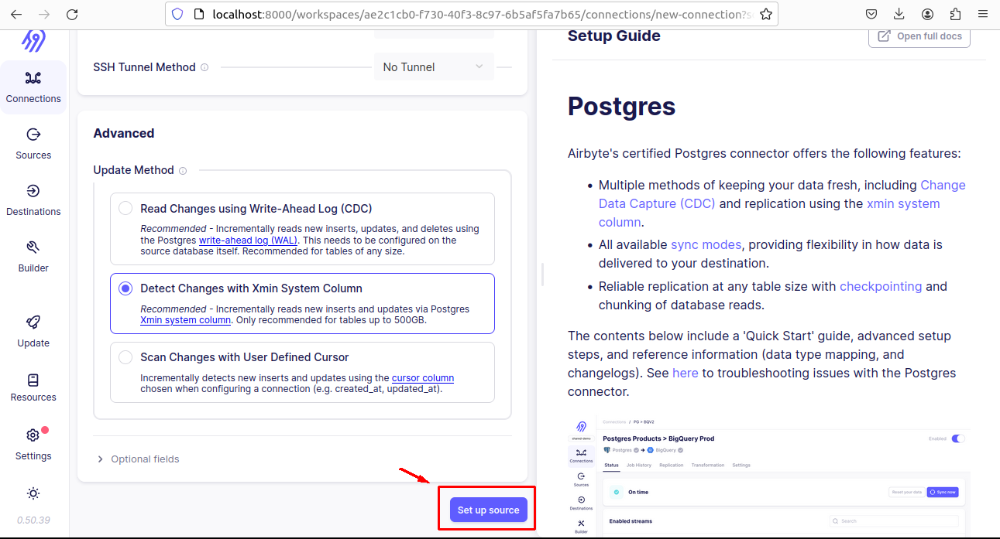

            - Set up new destination (S3 & MinIO boths use S3)
            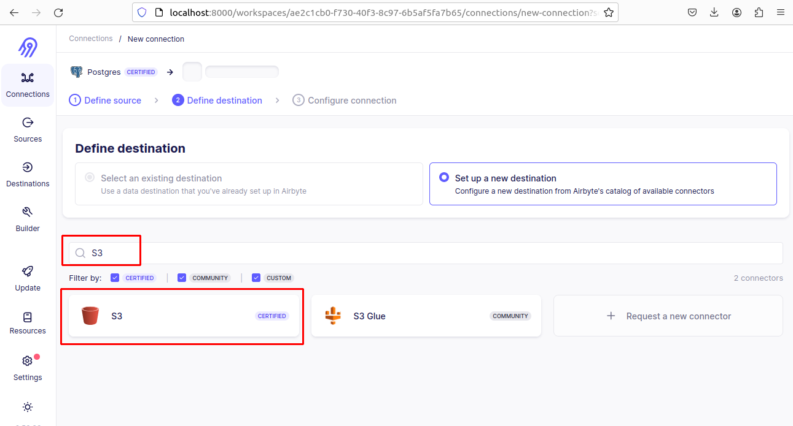 

            - Configure destination value, then click "Set up destination" 
            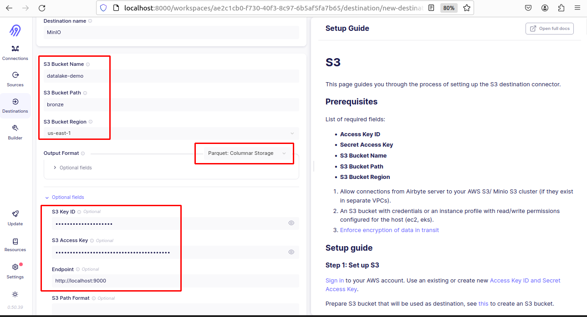 
        
        - Ingest data from source to destination 

            - Configure ingestion 
            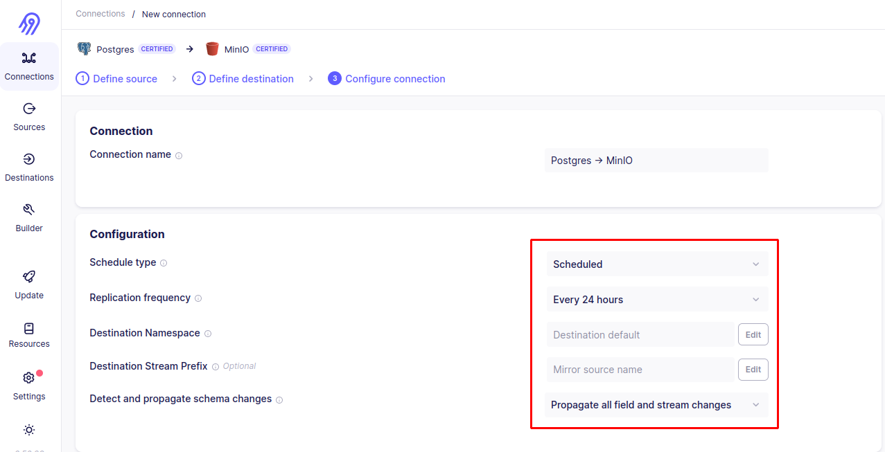
            
            - Choose table you want to sync, then click "Set up connection"
            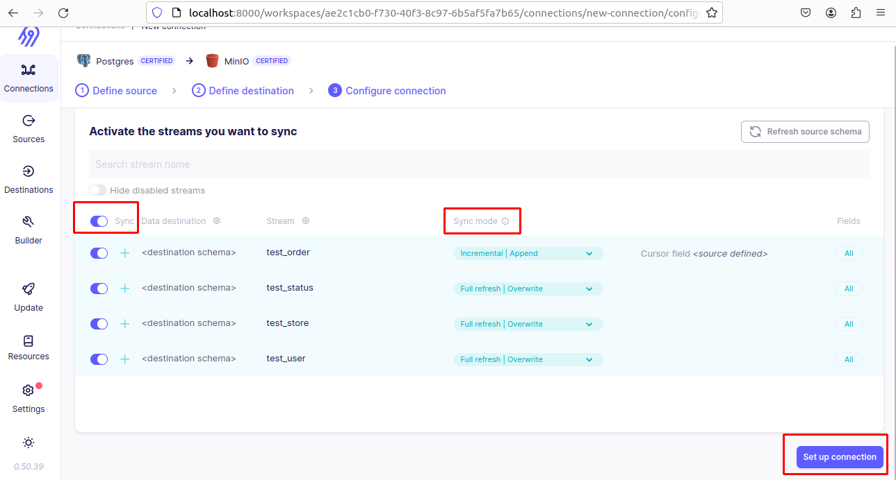

            - Screen show status of sync process, all passed 
            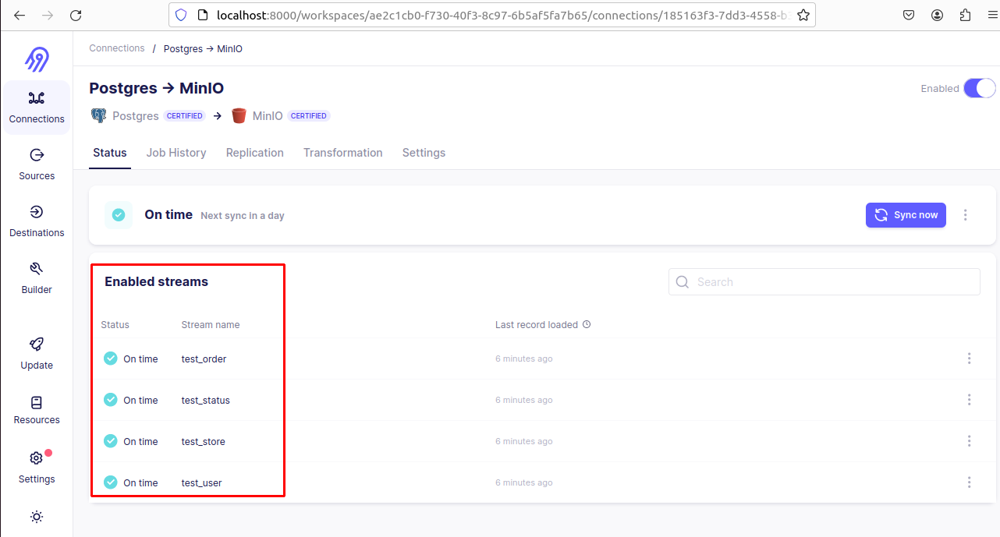


    - Create the connection between Trino & MinIO 
        ```yml
        # Navigate to the folder trino 
        cd datalake/trino 
        # Create the '.env' file (replace myaccesskey with access_key created in MinIO)
        echo "MINIO_ACCESS_KEY=myaccesskey" > .env
        echo "MINIO_SECRET_KEY=mysecretkey" >> .env
        # Update docker-compose.yml with these values
        version: '3'
        services:
        trino:
            container_name: trino-container
            image: trinodb/trino
            ports:
            - "8081:8080"
            env_file:
            - .env
            environment:
            - TRINO_CONFIG_PROPERTIES=node.environment=production
            - TRINO_CONNECTOR_MINIO_ENDPOINT=http://minio-server:9000  
        # Restart container 
        docker-compose restart trino      
        ```
    - Create dbt project 
    - Transform data using dbt + trino 
    - Write Airflow DAGs to monitor dbt workflow / airbyte 
    - CI/CD with Gitlab 
    - Connect Storage to consumption 

5. Support Links 
- https://www.snowflake.com/trending/data-centralization
- https://aws.amazon.com/what-is/data-lake/
- https://www.mongodb.com/databases/data-lake-architecture
- https://www.guru99.com/data-lake-architecture.html
- https://www.altexsoft.com/blog/data-lake-architecture/
- https://www.databricks.com/blog/2020/01/30/what-is-a-data-lakehouse.html
- https://www.upsolver.com/blog/intro-to-aws-data-lakes-components-architecture
- https://aws.amazon.com/vi/blogs/big-data/aws-serverless-data-analytics-pipeline-reference-architecture/
- https://www.databricks.com/glossary/medallion-architecture


